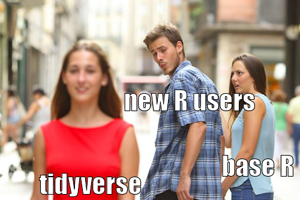
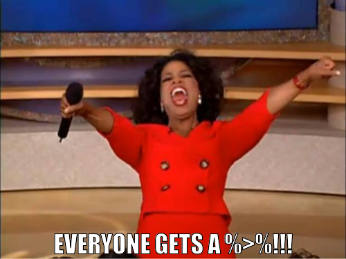
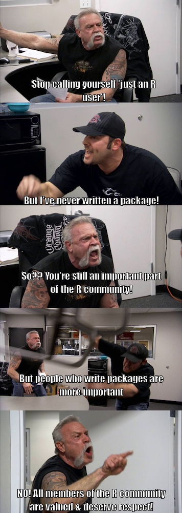

# memer 

<!-- badges: start -->

[](https://travis-ci.org/sctyner/memer)
[](https://ci.appveyor.com/project/sctyner/memer)
[](https://cran.r-project.org/package=memer)
<!-- badges: end -->

## Overview

memer is a a `tidyverse`-compatible `R` package for creating memes.
Mostly wrappers around `magick` functions.

## Installation

``` r
# Install the development version from GitHub:
# install.packages("devtools")
devtools::install_github("sctyner/memer")
```

## Available Memes

``` r
library(memer)
meme_list()
```

    ##  [1] "AllTheThings"       "AmericanChopper"    "AncientAliens"     
    ##  [4] "BatmanRobin"        "DistractedBf"       "EvilKermit"        
    ##  [7] "ExpandingBrain"     "FirstWorldProbs"    "FryNotSure"        
    ## [10] "IsThisAPigeon"      "NoneOfMyBusiness"   "CheersLeo"         
    ## [13] "OneDoesNotSimply"   "DosEquisMan"        "OffRamp"           
    ## [16] "OprahGiveaway"      "Philosoraptor"      "PicardFacePalm"    
    ## [19] "PicardWTH"          "PutItPatrick"       "Spongebob"         
    ## [22] "SuccessKid"         "ThatWouldBeGreat"   "TheRockDriving"    
    ## [25] "ThinkAboutIt"       "TrumpBillSigning"   "TwoButtonsAnxiety" 
    ## [28] "WhatIfIToldYou"     "CondescendingWonka" "Y-U-NOguy"         
    ## [31] "ShiaJustDoIt"       "Rainbow"            "Purples"

## Usage

``` r
meme_get("DistractedBf") %>% 
  meme_text_distbf("tidyverse", "new R users", "base R")
```



``` r
meme_get("OprahGiveaway") %>% 
  meme_text_bottom("EVERYONE GETS A %>%!!!", size = 36)
```



``` r
meme_get("AmericanChopper") %>%
  meme_text_chopper("Stop calling yourself 'just an R user'!",
                    "But I've never written a package!",
                    "So?? You're still an important part of the R community!",
                    "But people who write packages are more important",
                    "NO! All members of the R community are valued & deserve respect!")
```



## Post R Memes directly to Twitter\!

You can also post R memes directly to Twitter. You will need to install
the [rtweet](https://github.com/mkearney/rtweet/) package for that. Just
make sure to set up a Twitter token ([see here for more information on
that](https://rtweet.info/articles/auth.html)) and you are good to go.
The `tweet_meme` function also includes the possibility to tag the [R
Memes for Statistical Fiends](https://twitter.com/rstatsmemes) account
on Twitter for maximum exposure :)

``` r
meme_get("DosEquisMan") %>% 
  meme_text_top("I don't always tweet memes", size = 28) %>% 
  meme_text_bottom("But when I do\nI use the memer package in R", size = 26) %>%
  meme_tweet(tweet_text = "It's dangerous to meme alone. Here take this.",
             tag_rstatsmemes = T)
```


