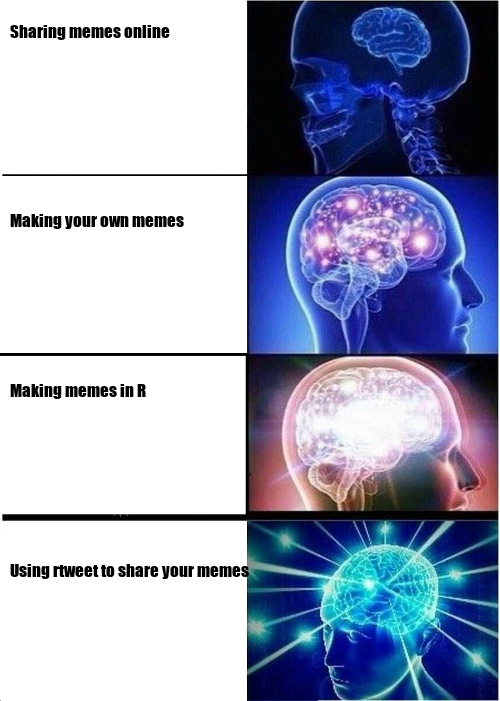

# memer 

<!-- badges: start -->

[](https://travis-ci.org/sctyner/memer)
[](https://ci.appveyor.com/project/sctyner/memer)
[](https://cran.r-project.org/package=memer)
<!-- badges: end -->

## Overview

memer is a a `tidyverse`-compatible `R` package for creating memes.
Mostly wrappers around `magick` functions.

## Installation

``` r
# Install the development version from GitHub:
# install.packages("devtools")
devtools::install_github("sctyner/memer")
```

## Available Memes

``` r
library(memer)
meme_list()
```

    ##  [1] "AllTheThings"       "AmericanChopper"    "AncientAliens"     
    ##  [4] "BatmanRobin"        "DistractedBf"       "EvilKermit"        
    ##  [7] "ExpandingBrain"     "FirstWorldProbs"    "FryNotSure"        
    ## [10] "HotlineDrake"       "IsThisAPigeon"      "NoneOfMyBusiness"  
    ## [13] "CheersLeo"          "OneDoesNotSimply"   "DosEquisMan"       
    ## [16] "OffRamp"            "OprahGiveaway"      "Philosoraptor"     
    ## [19] "PicardFacePalm"     "PicardWTH"          "Purples"           
    ## [22] "PutItPatrick"       "Rainbow"            "ShiaJustDoIt"      
    ## [25] "Spongebob"          "SuccessKid"         "ThatWouldBeGreat"  
    ## [28] "TheRockDriving"     "ThinkAboutIt"       "TrumpBillSigning"  
    ## [31] "TwoButtonsAnxiety"  "WhatIfIToldYou"     "CondescendingWonka"
    ## [34] "YoDawg"             "YoDawg"             "Y-U-NOguy"

## Usage

``` r
meme_get("DistractedBf") %>% 
  meme_text_distbf("tidyverse", "new R users", "base R")
```


``` r
meme_get("OprahGiveaway") %>% 
  meme_text_bottom("EVERYONE GETS A %>%!!!", size = 36)
```


``` r
meme_get("AmericanChopper") %>%
  meme_text_chopper("Stop calling yourself 'just an R user'!",
                    "But I've never written a package!",
                    "So?? You're still an important part of the R community!",
                    "But people who write packages are more important",
                    "NO! All members of the R community are valued & deserve respect!")
```


## Post R Memes directly to Twitter\!

``` r
meme_get("ExpandingBrain") %>% 
  meme_text_brain("Sharing memes online", 
                  "Making your own memes", 
                  "Making memes in R", 
                  "Using rtweet to share your memes", 
                  size = 17)
```



You can also post memes directly to Twitter. You will need to install
the [rtweet](https://github.com/mkearney/rtweet/) package for that. Just
make sure to set up a Twitter token ([see here for more information on
that](https://rtweet.info/articles/auth.html)) and you are good to go.
The `meme_tweet` function also includes the possibility to tag the [R
Memes for Statistical Fiends](https://twitter.com/rstatsmemes) account
on Twitter for maximum exposure :)

``` r
meme_get("DosEquisMan") %>% 
  meme_text_top("I don't always tweet memes", size = 28) %>% 
  meme_text_bottom("But when I do\nI use the memer package in R", size = 26) %>%
  meme_tweet(tweet_text = "It's dangerous to meme alone. Here take this.",
             tag_rstatsmemes = T)
```


## Confused? Use `meme_explain()`\!

Using `meme_explain`, you can pass any of the meme names to be taken to
their page on [knowyourmeme.com](https://knowyourmeme.com/memes/).

:warning: :warning: :warning: Content from knowyourmeme.com may be
offensive. The authors of `memer` have no control over what you may see
when using `meme_explain()`.

``` r
meme_explain("DistractedBf", launch = F, content_warning = T)
```

    > knowyourmeme can contain potentially offensive results,
      are you sure you want to open it? [Y]es / [N]o:

## Add your own meme\!

:warning: :warning: :warning: This is an advanced step. Proceed with
caution.

If you want to add your own meme, use `memer:::meme_add()`:

1.  Fork this repo and clone to your system.
2.  Add your meme file to `inst/extdata`.
    1.  It should be a .png.
    2.  It should be small: resolution of 72 and width no more than 500
        pixels.
3.  Use `meme_add()` as below.

<!-- end list -->

``` r
setwd("path/to/your/memer")
meme_add("Memename", "memefile.png")
```

3.  Re-install `memer` as below:

<!-- end list -->

``` r
devtools::check(document = F)
devtools::install()
```

4.  (Optional) If you would like your meme to be added to `memer`,
    submit a pull request\!
